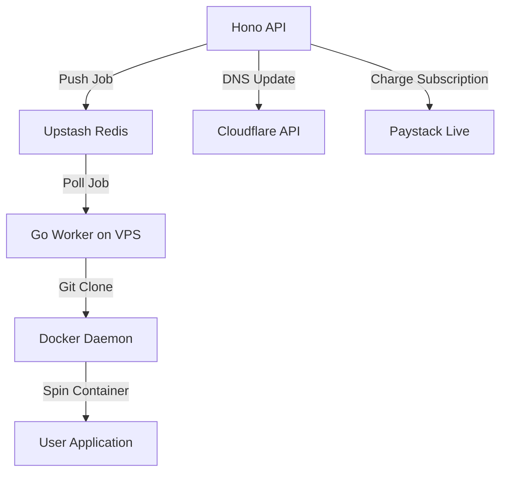

# NexGenHost — Production Architecture, Status, & Post-MVP Roadmap

This document summarizes the current status of the **NexGenHost Developer Console** project, the production deployments, the technologies utilized, integration fixes completed, and the roadmap for features to be implemented after the MVP.

---

## 🏗️ 1. What We Have Built So Far

We have implemented a fully functional monorepo workspace structured as follows:

*   **`apps/api` (Control Plane)**: 
    *   Powered by **Hono** & Node.js, compiling to ESNext modules.
    *   Implements secure **JWT authentication** (registration, login, profile management).
    *   Provides RESTful endpoints for projects, deployments, billing (Paystack), custom domains, and API keys.
    *   Integrates **BullMQ** as a job queue producer, pushing deployment tasks to Redis.
    *   Features an internal callback controller `/internal/deploy/callback` that allows the Go worker to report build steps and final container URLs back to the database.
*   **`apps/dashboard` (Developer Console UI)**:
    *   Built using **Next.js** (App Router) and styled with custom high-fidelity CSS matching the mockup.
    *   **Overview**: Dynamic stats (CPU, Memory, Bandwidth, active databases) and recent builds.
    *   **Projects**: Searchable table displaying projects, environment badges, runtime types, last commit, and live statuses, plus a sliding viewport-height Detail Drawer.
    *   **Deployments**: Detailed logs stream viewer, custom deployment search input, and a **Deploy Now** modal that lets users manually trigger custom builds for any project.
    *   **Databases**: Card list of provisioned databases with a details drawer providing URI copy buttons.
    *   **Settings**: Tabbed interface covering Account info, Notifications, Teams, and a Danger Zone for deletions.
*   **`services/worker-go` (Worker Engine)**:
    *   Written in **Go 1.22**, designed to poll Redis queue jobs.
    *   Includes configurations to parse job payloads, trigger Git clones, generate builds, and report log outputs back to the API.

---

## 🌍 2. Live Production Deployments & Infrastructure

The application has been successfully deployed to the cloud, utilizing a modern serverless/managed stack:

| Component | Platform | Live URL / Connection Endpoint |
|---|---|---|
| **Next.js Frontend** | **Vercel** | [cloud-platform-dashboard.vercel.app](https://cloud-platform-dashboard.vercel.app) |
| **Hono Backend API** | **Render (Web Service)** | [cloud-platform-5vf4.onrender.com](https://cloud-platform-5vf4.onrender.com) |
| **PostgreSQL Database** | **Neon (AWS Ireland)** | `ep-lingering-queen-ab7atbuv-pooler.eu-west-2` |
| **Queue / Cache** | **Upstash Redis** | Configured via env variables |

---

## 🛠️ 3. Technologies & Tools Used

*   **Monorepo Tooling**: **Turborepo** + **pnpm workspaces** for rapid building, linting, and dependency resolution.
*   **Backend Server**: **Hono API framework** — lightweight, fast, and edge-compatible.
*   **ORM & Migrations**: **Prisma ORM** v5.22.0, providing type-safe database queries.
*   **UI/UX**: **Next.js 15 (Turbopack)** + Vanilla CSS for high performance, custom animations, and layout flexibilities.
*   **Job Processing**: **BullMQ** + Redis.
*   **Payments**: **Paystack SDK** (Test Mode).

---

## ⚡ 4. Integration Fixes Applied for Seamless Operations

To make the Next.js frontend and Hono backend work together smoothly, the following fixes were applied:

1.  **CORS Policy Configured**: Pushed origin rules to Hono (`index.ts`) allowing Vercel and local dashboard urls to interact with the Render API, enabling credentials (cookies/auth headers).
2.  **BullMQ Queue Name Standardized**: Replaced the colon separator `nexgenhost:deployments` with `nexgenhost-deployments` to prevent BullMQ crashes since colons are reserved for internal namespaces.
3.  **Prisma Version/Module Mismatch**: Fixed imports of `ioredis` in [`producer.ts`](file:///Users/harz/Documents/backUps/cloud-platform/apps/api/src/queue/producer.ts) by passing connection parameters as a plain config object, resolving TypeScript ESM module resolution conflicts.
4.  **Auto Schema Push**: Modified Render's `buildCommand` in [`render.yaml`](file:///Users/harz/Documents/backUps/cloud-platform/render.yaml) to run `npm run prisma:push` automatically, ensuring the Neon DB is kept in sync with the Prisma schema on every code push.

---

## 🚀 5. Post-MVP Roadmap (Future Implementations)

To transition this from a frontend-and-API mock setup to a fully automated cloud hosting platform, the following features need to be implemented:

### 1. Activating the Go Worker Engine
*   **Action**: Deploy the `services/worker-go` daemon to a dedicated Ubuntu virtual machine (e.g. Oracle Cloud Free Tier instance).
*   **Details**: Configure it to run as a systemd service, connect to the Upstash Redis queue, poll deployment jobs, run `docker build` using the cloned code, and route traffic to the container port.

### 2. Automated DNS Management via Cloudflare
*   **Action**: Implement the Cloudflare API integration in Hono backend.
*   **Details**: When a user creates a project or adds a custom domain, the Hono API will make a POST request to Cloudflare's DNS endpoint to dynamically configure `A` or `CNAME` records pointing to our worker node.

### 3. SSL/TLS Certificate Provisioning
*   **Action**: Configure a reverse proxy manager (like **Nginx Proxy Manager** or **Caddy**).
*   **Details**: Set up Let's Encrypt automated certificate requests (ACME client) to auto-provision SSL/TLS certificates for any newly pointed subdomain or custom domain.

### 5. Production Billing Integration
*   **Action**: Complete Paystack webhook routing.
*   **Details**: Configure live production keys and listen for recurring payment events from Paystack webhooks to automatically upgrade/downgrade subscription statuses in the database.
